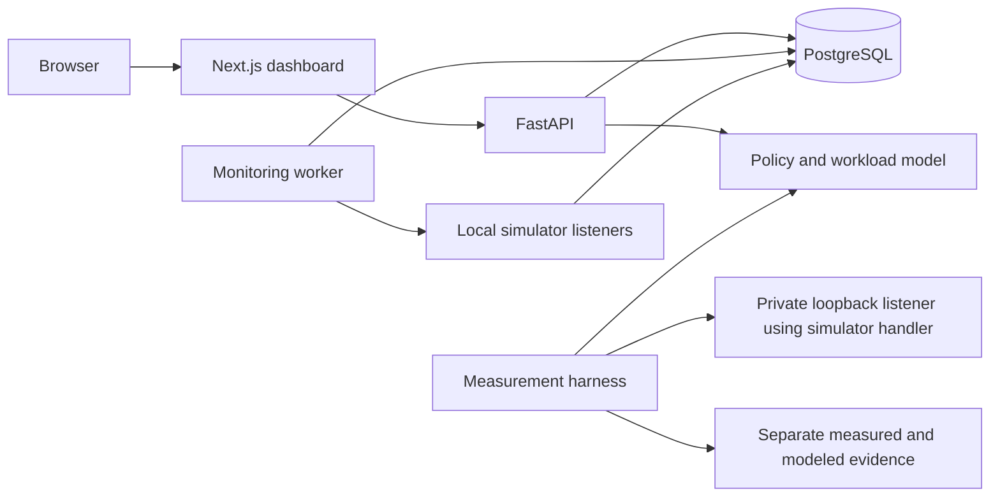

# Architecture overview

```mermaid
flowchart LR
  Browser --> Next[Next.js dashboard]
  Next --> API[FastAPI]
  API --> DB[(PostgreSQL)]
  Worker[Monitoring worker] --> Sims[Local simulator listeners]
  Worker --> DB
  Sims --> DB
  API --> Model[Policy and workload model]
  Harness[Measurement harness] --> Private[Private loopback listener using simulator handler]
  Harness --> Model
  Harness --> Evidence[Separate measured and modeled evidence]
```

The native setup, fault demonstration, and benchmark commands are in the [README](../README.md). Docker Compose is provided as an unverified deployment path.
